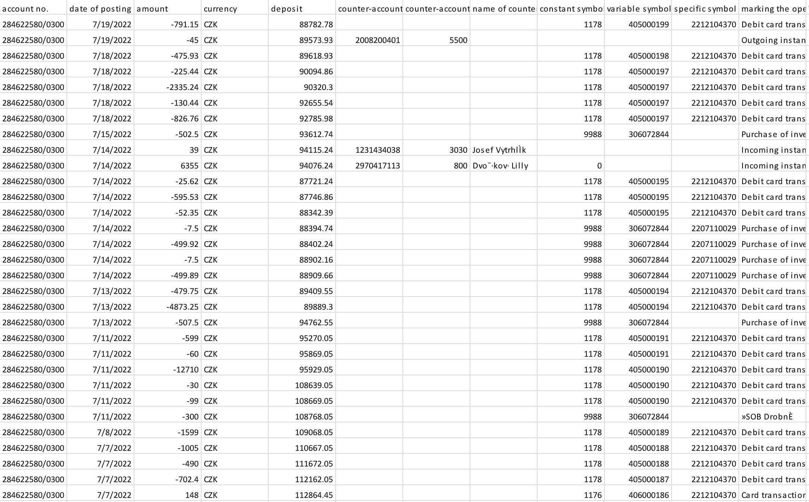
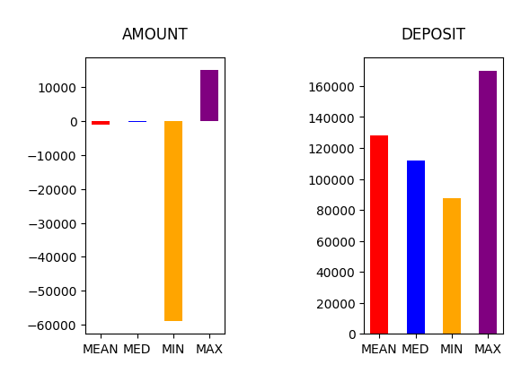
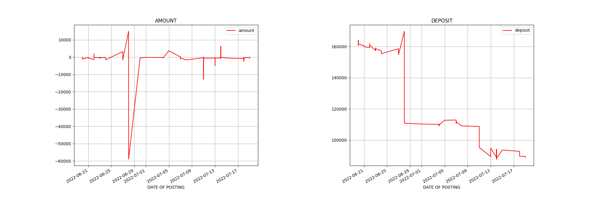

# Bee IT

## Kurz jazyka Python

### Projekt 1: Analýza bankovního účtu

Cílem projektu je vytvoření programu pro analýzu informací na bankovním účtu. Datový soubor s takovými informacemi si můžete vygenerovat ve svém internetovém bankovnictví (zkuste hledat v nápovědě na webu nebo v aplikaci) nebo můžete využít přiložený datový soubor "csob.xls", který máte ve složce dataset. Datový soubor by měl být ve formátu xls, tedy Excelovská tabulka.



Program přijme soubor s výpisem bankovních transakcí (vklady, výběry, platby) z internetového bankovnictví a provede statistickou analýzu vybraných sloupců (např.: průměrná hodnota výběru, medián hodnoty vkladu, největší a nejmenší hodnoty vkladů a výběru, aj.). 



Dále vykreslí do grafu liniové grafy pro zvolené informace v daném indexu (hodnoty na ose x = kategorie) od zadané počáteční hodnoty (typicky datum) do zvolené konečné hodnoty.



Pro spuštění ukázkového programu je zapotřebí nainstalovat si všechny potřebné závislosti. Postupujte následovně:

1. Vytvořte si ve vašem vývojovém prostředí pracovní adresář pro projekt a přesuňte se tam.
2. Vytvořte si v pracovním adresáři virtuální prostředí ```python -m venv venv```.
3. Aktivujte si virtuální prostředí ```source venv/bin/activate``` na MacOS/Linux nebo ```venv\Scripts\activate``` na Windows.
4. Nainstalujte si potřebné závislosti ze souboru requirements.txt v tomto repozitáři pomocí příkazu ```pip install requirements.txt```.
5. Stáhněte si program ```app.py``` a adresář ```dataset``.

Program obsahuje velké množství parametrů, za které můžete zadávat argumenty z příkazové řádky. Zde je seznam parametrů, které jsou nejdůležitější:

```
--src: cesta ke zdrojového souboru s daty
--show_figs: příznak, zda se mají výsledné grafy vykreslit na obrazovku (jinak se jen uloží do souboru)
--is_index_dt: příznak, zda je zvolený index ve formátu datumo-času (datetime)
--index: volba sloupce, kterého má program považovat za kategorii (osa x)
--plot_in_one: příznak pro vykreslení všech dílčích grafů do jednoho velkého multigrafu v souboru
--cols_to_plot: seznam sloupců ze zdrojového souboru, které chceme analyzovat
```

Nápovědu k parametrům je také možné získat pomocí specifikování argumentu --help do příkazové řádky při volání programu (uvidíte seznam všech parametrů s nápovědou):

```
python app.py --help
```

Ukázka volání programu s argumenty:

```
python app.py --src dataset/csob.xls --show_figs --is_index_dt --index "date of posting" --plot_in_one --cols_to_plot "amount" "deposit"
```

Vaším úkolem je vytvořit obdobný program pro analýzu dat z internetového bankovnictví. K dispozici máte v adresáři ```cviceni``` 4 jupyter sešity, které vás naučí potřebným základním znalostem pro dokončení projektu. Adresář si můžete také stáhnout k sobě do pracovního prostředí. Hotový program v souboru ```app.py``` slouží jen jako cíl, kterého byste měli dosáhnout. Měli byste se vyhnout kopírování kódu z tohoto souboru.

Cvičení v Jupyter notebookách mají následující témata:

<table>
    <thead>
        <tr>
            <th>Číslo tématu</th><th>Název tématu</th><th>Odkaz na sešit</th>
        </tr>
    </thead>
    <tbody>
        <tr>
            <td>1</td><td>Analýza bankovního účtu</td><td>Datová analýza (DA)</td>
        </tr>
        <tr>
            <td>2</td><td>Datový dashboard pro počasí</td><td>Datová analýza (DA)</td>
        </tr>
    </tbody>
</table>